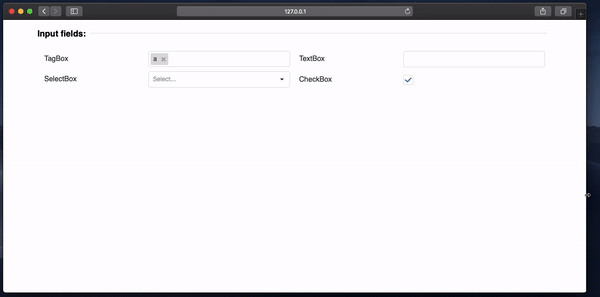

# DevextremeJsonFormGenerator

> Component for rendering a 12-column grid using DevExtreme by json template



## Compiled distro

To save your time there is [online demo](https://tripolskypetr.github.io/devextreme-json-form/) and [compiled distro](https://tripolskypetr.github.io/devextreme-json-form/distro.zip)

## Usage in Angular2 app

Check instruction [here](./src/mini-lib/README.md)

## Developer Guide

 - Running a local web server for development. For example, adding new components to the standard set of fields. Minimal experience with Angular2 is required

  ```
  npm start # check /src/mini-lib/fields
  ```

 - Assembling a web component to be placed on separate html pages

  ```
  npm build:mini-lib # check dist/mini-lib
  ```

## Usage

This tool can be easily applied in third party applications by using using [customElements](https://developer.mozilla.org/en-US/docs/Web/API/Window/customElements) (see code below). Also if you want to apply it in Angular2 application, check `app.component.ts`.

```
<mini-web-component data-miniKey="someComponent"></mini-web-component>
<script>
  window.someComponent = {
    fields: [
      {
        type: 'group',
        columns: '12',
        title: 'Input fields:',
        fields: [
          {
            type: 'group',
            columns: '6',
            fields: [
              {
                type: 'label',
                title: 'TagBox',
                columns: '6',
              },
              {
                type: 'tag-box',
                name: 'arr',
                items: ['a', 'b', 'c'],
                defaultValue: ['b'],
                columns: '6',
              },
              {
                type: 'label',
                title: 'SelectBox',
                columns: '6',
              },
              {
                type: 'select-box',
                name: 'arr1',
                items: ['a', 'b', 'c'],
                columns: '6',
              },
            ]
          },
          {
            type: 'group',
            columns: '6',
            fields: [
              {
                type: 'label',
                title: 'TextBox',
                columns: '6',
              },
              {
                type: 'text-box',
                name: 'text',
                columns: '6',
              },
              {
                type: 'label',
                title: 'CheckBox',
                columns: '6',
              },
              {
                type: 'check-box',
                name: 'omg',
                columns: '6',
              },
            ]
          }
        ]
      }
    ],
    handler: () => new Promise((res) => res({arr: ['a'], arr1: [], omg: true, text: 'hello!'})),
    change: (data) => console.log(data),
  }
</script>
```

## Why the renderer is named as a `mini-component`?


